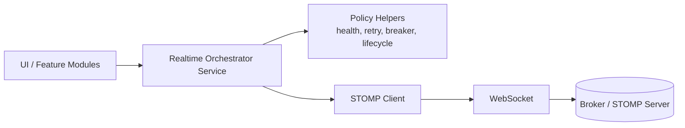
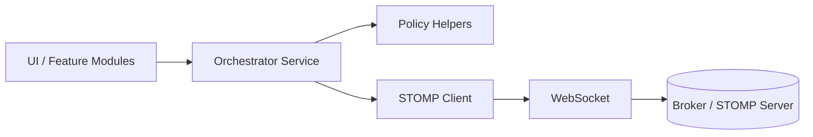
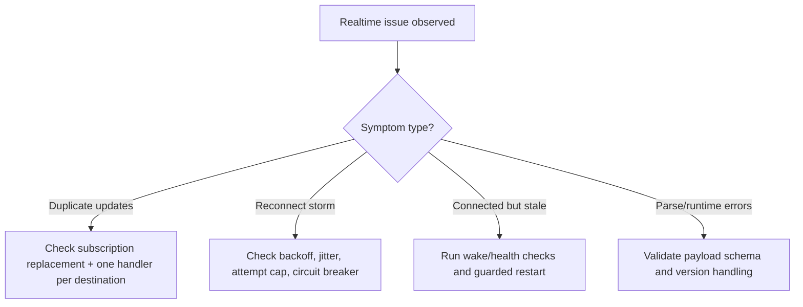
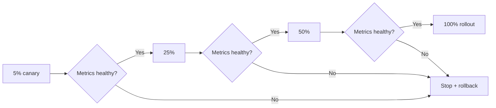
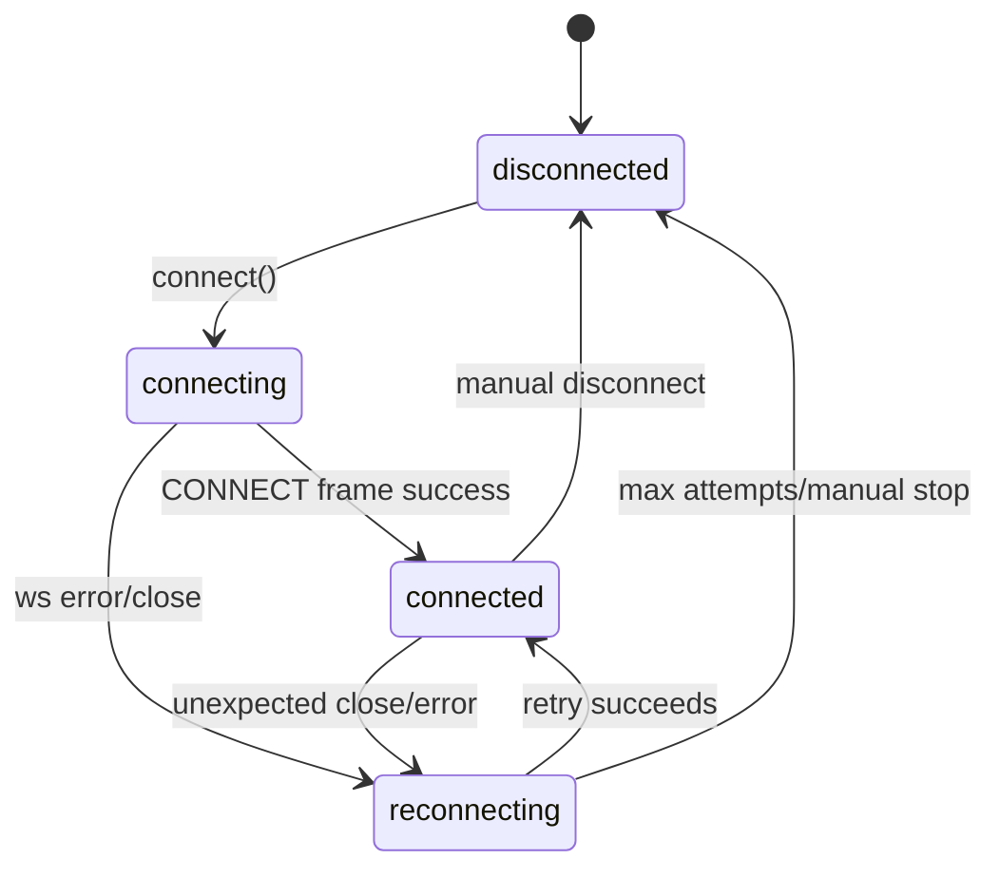
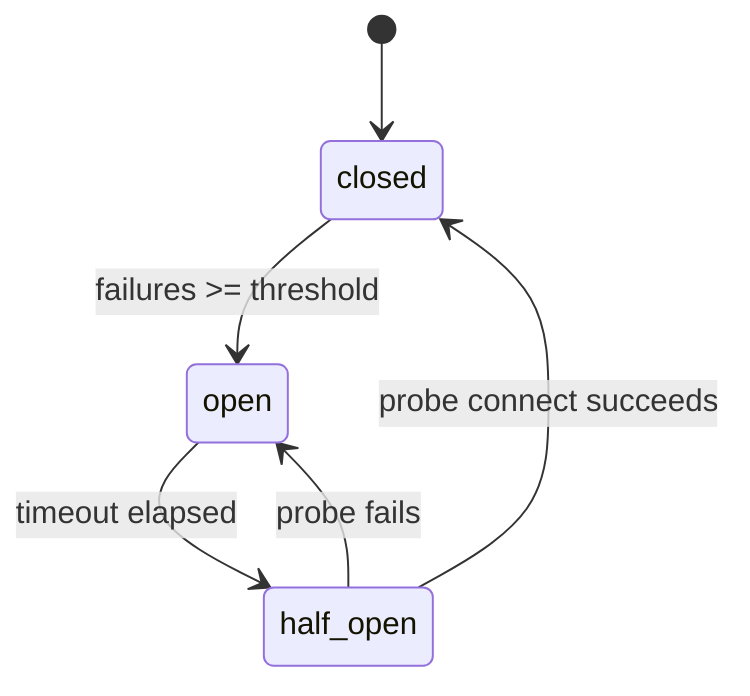
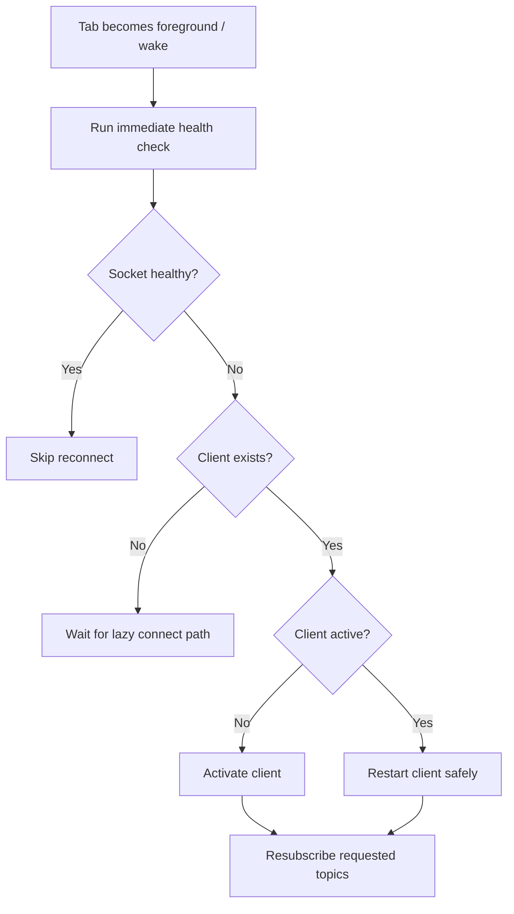
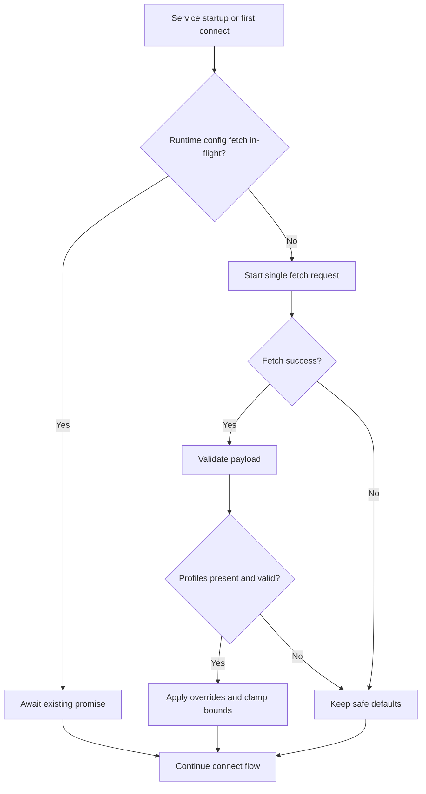
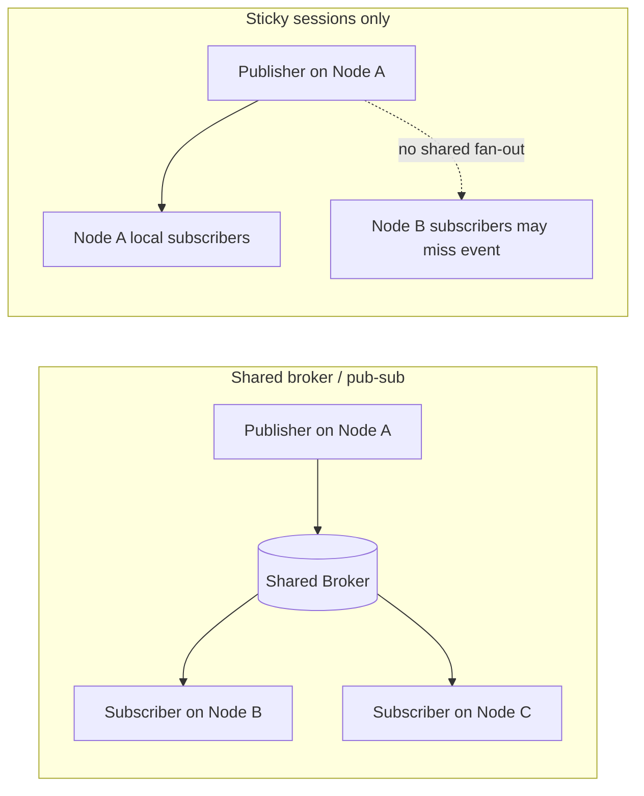

# STOMP Socket Services: Zero to Production

This document is written for engineers who do **not** have access to our code and may be new to realtime systems.

Goal: after reading this, you should understand what STOMP/WebSocket services do, why they fail in real life, and how to design one that is production-grade.

Estimated read time: 35-45 minutes (or 30 minutes for the fast-start path below).

### Start here if you only have 30 minutes

Read these sections in order:
1. section 1 (big picture)
2. section 4 (reference architecture)
3. section 6 (reconnect done right)
4. section 8 (subscription safety)
5. section 20 (starter defaults appendix)

New to STOMP terms? Skim section 2 first, especially the quick glossary.

## Quick-start blueprint (60-second view)

This section gives you the fastest possible mental model before diving into details.



If this blueprint makes sense, the rest of the guide explains how to harden each part for production.
For copy/paste starter config, jump to section 20.

## How to read the diagrams in this guide

- **State diagram**: boxes are states, arrows are transitions caused by events.
- **Flowchart**: diamonds are decisions, rectangles are actions, arrows show execution flow.
- If multiple arrows leave a decision, treat them as mutually exclusive runtime branches.
- Read top-to-bottom first, then left-to-right for alternate paths.

## Visual quick references

Use these as fast orientation maps before reading the detailed sections.

### A) Runtime architecture at a glance



Caption: one orchestrator owns lifecycle; helpers own policy decisions.

### B) Pitfall triage flow



Caption: map symptoms to the first fix area before deep debugging.

### C) Rollout ladder



Caption: only increase traffic when reconnect rate, error rate, and latency stay within thresholds.

---

## 1) Big picture: what problem are we solving?

This section explains why realtime transport exists, when it is worth using, and what success looks like.

Most apps start with HTTP request/response:
- client asks
- server responds
- connection ends

Realtime apps need the opposite direction too:
- server pushes events whenever they happen
- clients receive updates without polling

A STOMP-over-WebSocket service gives you that push channel with a message protocol that is easier to reason about than raw WebSocket frames.

### In practice: when you need this

Use a realtime channel when your users care about low-latency state changes such as:
- live dashboards
- trading/price feeds
- collaborative editing/presence
- alerting/incident consoles
- operational monitoring views

If updates can tolerate delay and low frequency, polling may be simpler and cheaper.

### Outcome you should target

Your service should deliver updates quickly **and** remain stable under unstable network conditions.
Speed without resilience is not useful in production.

---

## 2) Core concepts (plain English)

This section defines the fundamental terms and mental model you need before discussing implementation details.

### WebSocket
A persistent TCP-based connection between client and server.
- HTTP is used only for the initial upgrade handshake.
- After that, both sides can send messages at any time.

### STOMP
A text-based messaging protocol that runs on top of WebSocket.
- Think of it as adding a standard envelope to messages.
- Frames include commands like `CONNECT`, `SUBSCRIBE`, `SEND`, `MESSAGE`, `ERROR`.

### Broker-style topics
Clients subscribe to destinations (often topic-like names such as `/topic/orders`).
- publisher sends to destination
- all subscribers receive messages

### Heartbeats
Lightweight keepalive pings used to detect dead/stalled connections.
- without heartbeats, a broken connection can look alive for too long

### Reconnect strategy
When connection drops, client retries with controlled delay.
- required in mobile, Wi-Fi handoff, VPN, background tab scenarios

### Ack mode (important later)
Many STOMP setups support acknowledgment modes:
- `auto`: messages are considered handled automatically
- `client`/`client-individual`: consumer explicitly acknowledges

If you need stronger delivery control, choose and document your ack strategy early.

### Transport vs protocol vs domain events

- **Transport**: WebSocket pipe
- **Protocol**: STOMP frame semantics on top of the pipe
- **Domain events**: your app payloads (`orderUpdated`, `recordChanged`, etc.)

Keeping these concepts separate helps prevent architecture confusion.

### Quick glossary reference

- **STOMP**: simple text protocol for messaging frames over socket transport.
- **Destination**: logical address used for publish/subscribe.
- **Heartbeat**: periodic keepalive signal.
- **Circuit breaker**: safety mechanism to pause retries during repeated failures.
- **Jitter**: random delay variation to avoid synchronized retries.
- **Single-flight**: deduplicating concurrent requests so only one executes.
- **Canary**: gradually releasing a new version to a small portion of traffic before full rollout.
- **SLO**: service-level objective (target reliability/latency/error thresholds).

---

## 3) Why naive implementations fail

This section highlights the most common failure patterns in real environments and why basic socket code breaks in production.

A naive service usually does:
1. connect once
2. subscribe
3. retry immediately on failure

This usually looks great in a demo and then gets very humble in production.

It fails because real environments are messy:
- browser goes offline briefly
- laptop sleeps, tab is suspended, then wakes
- corporate proxies kill idle sockets
- backend restarts during deploy
- duplicate subscriptions happen after reconnect
- malformed payloads crash parsing
- infinite retry loops create backend pressure

A production design plans for these by default.

### Typical incident pattern

1. Deploy introduces a subtle reconnect bug
2. clients start retrying aggressively
3. backend load rises
4. more disconnects happen
5. feedback loop amplifies outage

This is why reconnect policy + circuit breaker + observability must be designed together.
(Otherwise you accidentally build an outage amplifier.)

### Prevention mindset

Treat instability as normal, not exceptional.
Design for failure first, then optimize for convenience.

---

## 4) Reference architecture (vendor/framework neutral)

This section gives a practical architecture blueprint that keeps realtime code maintainable and testable over time.

Use two layers:

### A) Orchestrator service

This subsection defines the single service that owns connection lifecycle and coordinates all realtime behavior.
Single place that owns connection lifecycle.
Responsibilities:
- create socket/STOMP client
- connect/disconnect/reconnect lifecycle
- map inbound messages to app events
- expose state for UI and calling code

Think of the orchestrator as the **traffic controller** for realtime behavior.
It should be the only place in your client app that directly talks to the STOMP client object.

Why this matters:
- avoids multiple components creating competing socket clients
- keeps connection state consistent across the app
- makes testing and incident debugging much easier

### What should live in the orchestrator (and what should not)

Should live here:
- public API methods like `connect`, `disconnect`, `subscribeToEvents`, `publish`
- client lifecycle hooks (`onConnect`, `onError`, `onClose`)
- app-level state exposure (`connected`, `reconnecting`, `lastError`)
- delegation to policy helpers (backoff, breaker, health decisions, etc.)

Should not live here:
- heavy decision logic mixed inline (move to helpers)
- feature-specific UI behavior
- direct business logic unrelated to transport/lifecycle

### Suggested orchestrator interface (framework-agnostic)

At minimum, expose:
- `connectToEvents(events)`
- `disconnect()`
- `publish(destination, payload)`
- `isConnected()`
- an event stream or callbacks for incoming domain events
- an event stream or callbacks for connection state changes

### Lifecycle flow inside orchestrator

1. Initialize defaults and runtime config.
2. Create STOMP client lazily on first demand.
3. Register lifecycle handlers (`onConnect`, `onStompError`, `onWebSocketClose`, `onWebSocketError`).
4. Activate client and subscribe requested topics after successful connect.
5. On failures, update state and invoke retry/circuit-breaker helpers.
6. On destroy/disconnect, unsubscribe, deactivate, and remove browser listeners.

### Minimal pseudocode example

```text
class RealtimeOrchestratorService {
	state = { connected: false, reconnecting: false }
	requestedEvents = Set()
	topicSubscriptions = Map()
	client = null

	connectToEvents(events):
		requestedEvents.addAll(events)
		if client is null:
			client = createStompClient()
			wireLifecycleHandlers(client)
			client.activate()
			return

		if client.connected:
			ensureRequestedSubscriptions()
		else if not client.active:
			client.activate()

	onConnect():
		state.connected = true
		state.reconnecting = false
		ensureRequestedSubscriptions()

	onSocketFailure(error):
		state.connected = false
		state.reconnecting = true
		invokeRetryAndBreakerPolicies(error)

	disconnect():
		clearSubscriptions()
		deactivateClient()
		state.connected = false

	destroy():
		removeBrowserListeners()
		disconnect()
}
```

This pattern gives teams a stable foundation: the orchestrator stays readable, while policy complexity is delegated to helper modules.

### B) Policy modules (small, testable helpers)

This subsection explains how to split complex reliability logic into focused modules with clear contracts.
Each helper solves one operational concern:
- network profile and reconnect timing
- runtime config loading
- tab visibility/sleep recovery logic
- connection health evaluation
- guarded restart flow
- subscription tracking/replacement
- circuit-breaker transitions

Policy modules are where reliability becomes manageable.
Instead of burying decisions in one giant service, each helper answers one question well.

### Why policy modules are worth it

- **Focused complexity**: each helper handles one concern end-to-end.
- **Better tests**: you can test decision logic without booting sockets/UI.
- **Safe refactors**: changing retry or breaker logic does not risk subscription code.
- **Shared language**: teams can discuss “health helper” or “breaker helper” clearly.

### What makes a good helper module

A helper should be:
- **pure or near-pure** where possible (input -> decision/output)
- **small API surface** (few exported functions/classes)
- **transport-agnostic** when possible (don’t depend on framework internals)
- **explicit about inputs/outputs** (typed context in, typed decision out)

### Suggested helper contract style

Prefer contracts like:
- input context object (all required state in one place)
- explicit return type (decision enum/result object)
- no hidden global state unless helper is stateful by design (e.g., circuit breaker tracker)

Example patterns:
- `evaluateWakeRecovery(context) -> decision`
- `evaluateSocketHealth(snapshot) -> evaluation`
- `recordFailure(config) -> { state, opened }`

### Stateful vs stateless helpers

- **Stateless helpers** (preferred default):
	- network profile resolution
	- health evaluation
	- wake recovery decision

- **Stateful helpers** (when necessary):
	- circuit breaker tracker (stores failure count/timestamps)
	- subscription manager (tracks active subscriptions)
	- restart coordinator (tracks in-flight restart suppression)

Rule of thumb: if state must persist across events, isolate it in a dedicated helper object.

### Testing policy modules

For each helper, test:
- happy-path decisions
- edge cases (undefined/missing values)
- boundary conditions (thresholds/timeouts)
- failure semantics (suppression, skip reasons, fallback behavior)

This gives high confidence with low test runtime.

### Minimal helper template (copy/adapt)

```text
// input model
type Context = { isOnline: boolean, hasClient: boolean, isHealthy: boolean }

// output model
type Decision = 'skip' | 'activate' | 'restart'

function evaluateSomething(context: Context): Decision {
	if (!context.hasClient) return 'skip'
	if (!context.isOnline) return 'skip'
	if (context.isHealthy) return 'skip'
	return 'restart'
}
```

### Anti-patterns for helper modules

Avoid:
- helpers that call UI APIs directly
- helpers that mutate unrelated shared state
- helpers with hidden side effects and no return value
- one mega-helper that recreates the monolith problem

If one helper needs a table of contents, it is probably not a helper anymore.

This separation is one of the highest-impact design decisions for long-term maintainability.

Why this is high-impact in practice:
- it prevents the “god service” anti-pattern where reconnect, health, subscriptions, and UI concerns become tightly coupled
- it reduces change risk because each policy can evolve independently with smaller blast radius
- it improves testability by turning hidden side effects into explicit helper contracts
- it speeds incident debugging because failures can be isolated to one policy area quickly
- it enables parallel team delivery without constant conflicts in one monolithic realtime file

---

## 5) Connection lifecycle you should implement

This section describes the required connection states and transitions so your service behaves predictably across normal and failure paths.



### States
Use explicit states at minimum:
- disconnected
- connecting
- reconnecting
- connected

Optional states that help larger systems:
- `suspended` (intentionally paused)
- `degraded` (connected but unhealthy indicators)
- `blocked` (circuit breaker open)

### Happy path
1. load config
2. create client
3. connect
4. subscribe requested topics
5. receive/publish messages

Add one more step in mature systems:
6. emit telemetry that confirms subscribe success and initial readiness.

### Failure path
1. detect error/close
2. update state to reconnecting
3. backoff + jitter delay
4. retry until success or attempt cap

Also record:
- reason code (offline, ws_close, protocol_error, timeout)
- attempt count
- current profile/config snapshot

### Manual disconnect path
When the user or app intentionally disconnects:
- mark manual intent
- stop retries
- clear subscriptions
- close connection

Manual disconnect must be explicitly distinguished from unexpected close events.
If not, you get accidental reconnect loops after user logout or navigation.

---

## 6) Reconnect done right

This section covers retry mechanics, jitter, attempt ceilings, and circuit-breaker behavior to prevent reconnect storms.



### Exponential backoff with jitter
Use:
- `delay = min(base * 2^(attempt-1), max) + random(0..jitter)`

Why:
- avoids synchronized reconnect spikes from many clients

### Retry ceilings
Set max attempts for each session period.
Why:
- infinite retries hide failures and waste resources

Retrying faster rarely fixes outages; it mostly reaches failure faster.

After hitting max attempts, move to a visible degraded state and provide a manual retry action.

### Circuit breaker
States:
- closed: normal
- open: block connect attempts temporarily
- half-open: allow probe reconnect

Why:
- protects backend and client from thrash when environment is unhealthy

### Suggested starting values (tune later)
- base delay: 1s
- max delay: 30s
- jitter: 250–1000ms
- max attempts per window: 15–30
- breaker threshold: 5 failures
- breaker timeout: 30–60s

These are starting points, not universal truths.
Tune them using real traffic and production telemetry.

---

## 7) Browser and tab realities (must implement)

This section explains client-side lifecycle realities (offline/online, background/wake) that often break realtime services.



### Offline/online events
- On offline: mark unavailable quickly, debounce, optionally force close active socket after grace period.
- On online: refresh config and reactivate/restart safely.

Also guard against false positives:
- online event can fire before route/DNS/proxy paths are truly healthy.
- use health checks to confirm recovery before declaring “connected.”

### Tab background/sleep/wake
- Track transitions (`hidden/visible`, `blur/focus`, page lifecycle events).
- On wake: run immediate health check.
- If healthy, skip reconnect; if unhealthy, recover.

This prevents unnecessary reconnect churn and data merge side effects.

### Mobile/browser nuance

Different browsers throttle timers and networking differently in background.
Do not rely on one event only; combine visibility + focus + page lifecycle where available.

---

## 8) Subscription safety

This section shows how to avoid duplicate handlers and stale subscriptions, especially after reconnect cycles.

Rule: one active subscription per destination.

On reconnect, many teams accidentally subscribe again without replacing old handlers.
Symptoms:
- duplicate UI updates
- memory leaks
- impossible debugging

Design:
- keep a map of destination -> subscription
- before subscribing, unsubscribe previous one
- clear all on disconnect/destroy

### Additional safeguards
- maintain a requested-topic set separate from active-subscriptions map
- subscribe only after confirmed connect
- log/metric subscription count and replacement events

### Good acceptance test
Run a reconnect-stability test with explicit pass/fail checks:

1. Subscribe to a known set of destinations (for example, 3 topics).
2. Force a disconnect and reconnect cycle 20 times (manual disconnect/reconnect or simulated network drop/recovery).
3. After each reconnect, record:
	- active subscription count per destination
	- number of handler invocations per incoming test message
4. Publish exactly one test message to each destination after every reconnect.
5. Assert all of the following are true on every cycle:
	- each destination has exactly one active subscription object
	- each test message triggers exactly one handler invocation
	- total subscriptions do not grow over time (no leak trend)

Fail the test if any destination shows duplicate handlers, missing handler invocation, or monotonically increasing subscription count across cycles.

---

## 9) Message safety and schema discipline

This section covers payload validation, schema evolution, and delivery semantics needed for durable event contracts.

Never trust inbound payloads.

Implement:
- guarded JSON parsing
- schema/type validation (at least runtime shape checks)
- drop invalid messages with telemetry
- explicit event schema versioning

Also define delivery semantics clearly:
- ordering expectations
- duplicate handling
- replay/recovery after long disconnect

### Recommended schema fields

Include these in each event payload envelope:
- `eventType`
- `version`
- `eventId`
- `emittedAt`
- `source`
- `payload`

`eventId` enables dedup strategies; `version` enables safe evolution.

### Backward compatibility rule

Prefer additive schema changes first.
Do not remove or rename fields without a migration/deprecation plan.

### Should you use a Web Worker for message handling?

Pros:
- keeps heavy parsing/transformation off the UI thread
- reduces frame drops/jank during burst traffic
- isolates CPU-heavy logic from rendering concerns

Cons:
- adds complexity (worker lifecycle, message passing, serialization)
- debugging is harder than same-thread code
- some state sharing patterns become awkward

Use a Web Worker when:
- payload parsing/transforms are non-trivial
- event rate is high enough to impact UI responsiveness
- you can keep worker API contracts clean and testable

Avoid it (initially) when:
- traffic is low/moderate
- logic is simple and latency/jank is already acceptable
- team is still stabilizing core reliability behavior

### What counts as low/moderate traffic here?

Use these as **starting bands per client session** (not global server throughput), assuming payloads are usually <= 5 KB and message handling is lightweight:

| Traffic band | Sustained event rate | Burst event rate (10–30s windows) | Worker guidance |
|---|---|---|---|
| Low | <= 10 events/second | <= 30 events/second | Stay on main thread unless UI jank appears |
| Moderate | 10-50 events/second | 30-150 events/second | Usually still main thread; consider queueing first |
| High | > 50 events/second | > 150 events/second | Strongly consider Web Worker (often with queue) |

Adjust these thresholds if payloads are larger, parsing is CPU-heavy, or target devices are low-power.
In practice, trigger worker adoption based on telemetry signals such as rising frame drops, long tasks, and increasing event processing latency.

### Should incoming events be queued before processing?

Queueing means ingesting events quickly, then processing in controlled order/rate.

Pros:
- smooths burst traffic and prevents handler overload
- gives deterministic ordering policy options
- enables backpressure strategies (drop/coalesce/retry)

Cons:
- adds latency between receive and apply
- requires queue policy decisions (size limits, overflow behavior)
- can hide upstream problems if queue metrics are not monitored

Use a queue when:
- bursts can overwhelm immediate processing
- you need explicit ordering and dedup strategy
- downstream transformations/storage are expensive

Avoid it (initially) when:
- realtime latency is more critical than throughput smoothing
- event volume is low and processing is cheap
- operational visibility for queue depth/age is not yet in place

### Practical recommendation

Start simple (direct processing), measure, then introduce queue and/or worker only when metrics justify it.
If you add either, add telemetry for:
- queue depth / oldest event age
- worker processing time
- dropped/coalesced event count
- end-to-end event latency

### Quick decision matrix

| Scenario | Direct Processing | Queue | Web Worker | Notes |
|---|---|---|---|---|
| Low event rate, cheap handlers | ✅ Best default | ❌ Usually unnecessary | ❌ Usually unnecessary | Keep architecture simple |
| Burst traffic, strict ordering needed | ⚠️ Risky under spikes | ✅ Recommended | ⚠️ Optional | Queue gives control/backpressure |
| Heavy parsing/transforms causing UI jank | ⚠️ UI can stutter | ⚠️ Helpful if bursts | ✅ Recommended | Worker offloads CPU from UI thread |
| High burst + heavy CPU work | ❌ Usually insufficient | ✅ Recommended | ✅ Recommended | Combine queue + worker, monitor latency |
| Ultra-low latency, lightweight payloads | ✅ Preferred | ⚠️ Adds latency | ⚠️ Added complexity | Optimize direct path first |

---

## 10) Runtime configuration strategy

This section explains how to tune socket behavior safely at runtime while preserving defaults and fallback reliability.



Do not hardcode all socket behavior.

Support runtime overrides from backend:
- heartbeat interval
- reconnect base/max/jitter
- max reconnect attempts
- health-check interval
- offline debounce
- circuit-breaker thresholds/timeouts

### Why have backend overrides at all?

Because reconnect and health behavior often need fast tuning **without shipping a new client build**.

Backend overrides let operations teams:
- react quickly during incidents (for example, slow reconnect storms by increasing backoff)
- tune behavior per environment (dev/stage/prod) with one client binary
- roll out policy changes gradually and reverse them quickly if metrics worsen
- align client behavior with current backend capacity and network conditions

Without overrides, every policy change requires a full frontend release cycle, which is slower and riskier during live outages.

### Example: reconnect storm mitigation

Suppose a backend deploy causes intermittent disconnects and clients begin reconnecting aggressively.
Using backend overrides, operators can immediately:
- increase reconnect base/max delay
- widen jitter
- tighten breaker thresholds temporarily

This reduces synchronized retry pressure within minutes, buys time for backend recovery, and avoids waiting for a new frontend release.
After stability returns, overrides can be rolled back gradually while watching reconnect and latency metrics.

### Example: environment/device tuning (non-incident)

Suppose production telemetry shows low-end mobile devices reconnect too often after background wake, while desktop clients are healthy.
With backend overrides, operators can apply a production profile that:
- increases offline debounce slightly
- relaxes health-check aggressiveness
- adjusts heartbeat interval for weaker networks

Result: fewer unnecessary reconnects on constrained devices, with no code change and no impact to dev/stage defaults.

Best practices:
- fetch once using single-flight (dedupe concurrent callers)
- keep safe defaults if fetch fails
- clamp unsafe values to sane bounds

### Operational recommendation

Treat runtime config as a controlled feature, not a free-for-all override.
- whitelist keys
- validate schema server-side
- log active profile and override source
- keep versioned config payloads

### Fallback policy

When runtime config fails:
1. log failure reason
2. continue with local defaults
3. mark telemetry flag `runtimeConfig=default`
4. retry fetch on next reasonable trigger (not hot loop)

---

## 11) Security requirements for production

This section defines the minimum security controls required before a realtime service can be considered production-ready.

Minimum bar:
- authenticate socket connection (token/cookie strategy)
- authorize subscribe/send destinations
- enforce WSS/HTTPS only
- strict allowed origins
- rate limits and payload-size limits
- server-side validation/sanitization
- no secrets in client bundles

If any of these are missing, you are not production-ready.

### Practical security checklist detail

- Expire tokens and handle refresh/reauth for long-lived sockets.
- Reject unauthorized destinations explicitly with auditable reasons.
- Enforce per-connection and per-IP message rate caps.
- Limit frame/body size to prevent memory abuse.
- Sanitize and validate all inbound payloads before business processing.

Security for realtime channels should be at least as strict as your HTTP APIs.

---

## 12) Observability and operations requirements

This section outlines telemetry, dashboards, alerts, and runbook practices required to operate realtime systems safely.

You need more than console logs.
Console logs are excellent for local debugging and terrible as an incident response strategy at scale.

Implement structured telemetry with fields like:
- event type
- timestamp
- session/connection id
- current state
- reconnect attempt/delay
- breaker state
- reason codes

Build dashboards + alerts for:
- reconnect spikes
- breaker open rate
- auth failures
- message latency
- disconnect rate

Have runbooks for:
- incident triage
- mitigation actions
- rollback
- postmortem data capture

### Minimum dashboard panels

- active connection count
- connect success rate
- reconnect attempts/minute
- breaker open count
- message throughput and end-to-end latency
- top error reasons (auth, network, protocol, payload)

### Suggested alert triggers (starter)

- reconnect attempts > baseline * 3 for 10 minutes
- breaker open events above threshold
- auth/handshake error ratio above threshold
- p95 message latency above agreed SLO

---

## 13) Scaling model (single node vs multi-node)

This section explains scaling choices and tradeoffs so behavior remains correct when you move beyond a single server.

Single node can appear fine in dev.
Production often runs multiple instances.

You must choose and document one:
1. shared broker/pub-sub backbone
2. sticky sessions with clear tradeoffs

Without explicit strategy, realtime behavior becomes inconsistent after scaling.

### Why a scaling model is required

In realtime systems, correctness depends on **where connections land** and **how events are distributed**.
If you scale to multiple nodes without an explicit model, you can get:
- missed events (publisher and subscriber end up on different nodes with no shared fan-out path)
- duplicate or out-of-order delivery during failover/reconnect
- inconsistent user experience between sessions (some clients receive updates, others do not)
- harder incident debugging because behavior depends on load balancer routing luck

A defined scaling model ensures predictable delivery semantics, clearer failure behavior, and repeatable operations as traffic grows.



Default recommendation: for correctness at multi-node scale, use a shared broker/pub-sub backbone; use sticky sessions only when constraints are explicit and accepted.
If your scaling plan depends on "hopefully the same node," that is not a plan.

### Tradeoff summary

Shared broker/pub-sub:
- pros: consistent fan-out semantics across nodes
- cons: extra infra/component management

Sticky sessions:
- pros: simpler at first
- cons: weaker failover characteristics and uneven load patterns

Document your choice and expected failure behavior before production launch.

---

## 14) Testing strategy that matters

This section defines the test layers that provide confidence under normal load, faults, and deployment changes.

### Unit tests
- reconnect timing
- breaker transitions
- health decision logic
- subscription replacement logic

### Integration tests
- connect -> subscribe -> receive -> publish
- reconnect after backend restart
- auth failure behavior

### Chaos/fault tests
- offline flapping
- tab sleep/wake
- high latency/loss
- malformed message injection

### Load tests
- sustained throughput
- spike bursts
- reconnect storm simulation

Production confidence requires all four levels.

### Good CI gating pattern

On every release branch:
1. unit + integration must pass
2. selected chaos scenarios must pass
3. load baseline must not regress beyond agreed threshold

Capture and publish trend history, not just pass/fail snapshots.

---

## 15) Maturity model: where are you now?

This section helps teams self-assess readiness level and prioritize the next improvements.

### Level 1: Basic
connect, subscribe, send, receive

### Level 2: Resilient
backoff, offline handling, health checks, wake recovery

### Level 3: Operable
structured telemetry, dashboards, alerts, runbooks

### Level 4: Production-grade
security complete, scaling strategy proven, chaos/load validated, clear SLOs

Aim for Level 4 before calling it production-grade.

### How to use this model

Run a quarterly self-assessment:
- score each level with evidence links (tests, dashboards, runbooks)
- identify top 3 gaps
- assign owners + target date

Maturity improves through repeated operational practice, not one-time implementation.

---

## 16) Practical rollout plan (suggested)

This section gives a phased deployment approach, including canary strategy and rollback readiness.

1. Build Level 2 reliability first.
2. Add security controls.
3. Add observability + alerting.
4. Validate with chaos/load tests.
5. Deploy with canary + rollback.

### Canary rollout reference (plain language)

A **canary** release means shipping the new version to a small percentage of real traffic first, then gradually increasing only if metrics stay healthy.

Example progression:
- 5% traffic for 15–30 minutes
- 25% traffic
- 50% traffic
- 100% traffic

Watch these signals before increasing:
- reconnect rate spikes
- WebSocket/STOMP error rate
- message latency regression
- auth/handshake failures

If any signal crosses thresholds, stop rollout and rollback.

Fastest way to fail: skip steps 2 and 3.
Second fastest: run a canary but ignore the metrics.

### Rollback readiness checklist

Before rollout starts, confirm:
- previous stable version is immediately deployable
- rollback command/playbook is tested
- alerts route to on-call owner
- canary stop criteria are pre-defined and documented

---

## 17) Common anti-patterns checklist

This section lists high-risk design and operational mistakes to avoid before and after launch.

Avoid these:
- giant monolithic socket service
- immediate infinite retries
- duplicate subscriptions on reconnect
- no runtime payload validation
- no auth/authorization for topics
- no metrics/alerts/runbooks
- assuming single-node behavior in production

Add these frequent mistakes too:
- mixing transport retries with business retries blindly
- treating all errors as reconnect-worthy (some should hard-fail)
- shipping without explicit ownership for realtime incidents

---

## 18) Copy-paste implementation checklist

This section provides a practical gate checklist teams can reuse for release reviews.

Use this as a quick gate:
- [ ] explicit connection states
- [ ] exponential backoff + jitter + max attempts
- [ ] circuit breaker
- [ ] offline/online handling
- [ ] tab wake recovery
- [ ] health mismatch detection
- [ ] one-subscription-per-destination management
- [ ] runtime config with safe defaults
- [ ] payload validation and schema policy
- [ ] authN/authZ + rate and size limits
- [ ] structured telemetry + dashboards + alerts
- [ ] runbooks + rollback tested
- [ ] integration + chaos + load tests passing

If several items are unchecked, you are not done.

### Review cadence recommendation

Re-run this checklist:
- before each major release
- after incidents
- when network topology or auth model changes

Treat checklist reviews as part of engineering operations, not as optional documentation work.

---

## 19) Further reading in this repository

This section points to companion documents for deeper implementation and production-readiness work.

- `Stomp socket service guide.md` (implementation-oriented guide)
- `Production readiness checklist.md` (deployment gate)
- `Load testing.md` (performance test guidance)

Suggested reading order for new teams:
1. this document (`Stomp socket service zero to prod.md`)
2. `Stomp socket service guide.md`
3. `Production readiness checklist.md`
4. `Load testing.md`

---

## 20) Starter defaults appendix (copy first, tune with telemetry)

This section gives a practical baseline profile you can start with before environment-specific tuning.

Use these as **initial defaults**, not permanent truths:

+---------------------------------------+-------------------+-------------------------------------------------------+
| Setting                               | Starter default   | Why this is a reasonable start                        |
+---------------------------------------+-------------------+-------------------------------------------------------+
| Heartbeat interval                    | 10000 ms          | Detects stale connections without excessive chatter   |
| Reconnect base delay                  | 1000 ms           | Fast first recovery attempt                           |
| Reconnect max delay                   | 30000 ms          | Caps retry wait and prevents runaway backoff          |
| Reconnect jitter                      | 500 ms            | Reduces synchronized retry spikes                     |
| Max reconnect attempts (windowed)     | 20                | Prevents infinite retry loops                         |
| Circuit breaker failure threshold     | 5 failures        | Opens quickly enough during repeated failure          |
| Circuit breaker open timeout          | 45000 ms          | Gives backend/network time to recover                 |
| Health-check interval                 | 15000 ms          | Balanced liveness signal for browser clients          |
| Offline debounce                      | 1000 ms           | Avoids flapping on brief network transitions          |
| Max payload size (server-enforced)    | 64 KB (starter)   | Limits memory abuse and oversized message risk        |
+---------------------------------------+-------------------+-------------------------------------------------------+

### Starter profile snippet

```json
{
	"heartbeatIntervalMs": 10000,
	"reconnect": {
		"baseDelayMs": 1000,
		"maxDelayMs": 30000,
		"jitterMs": 500,
		"maxAttemptsPerWindow": 20
	},
	"circuitBreaker": {
		"failureThreshold": 5,
		"openTimeoutMs": 45000
	},
	"healthCheckIntervalMs": 15000,
	"offlineDebounceMs": 1000,
	"maxPayloadSizeBytes": 65536
}
```

### Quick tuning rules

- If reconnect storms appear, increase base/max delay and jitter first.
- If user-visible stale sessions increase, reduce heartbeat and/or health-check interval carefully.
- If mobile battery/network overhead is high, increase heartbeat interval and validate with UX metrics.
- If event latency rises under load, evaluate queueing and Web Worker offload before increasing retry aggressiveness.

### Minimum telemetry to tune safely

Track at least:
- reconnect attempts per minute
- breaker open/half-open/closed transitions
- end-to-end event latency (p50/p95)
- disconnect reason distribution
- duplicate subscription detections

Tune one variable at a time, measure impact, then keep or revert.
